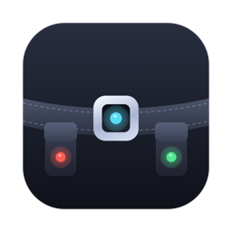
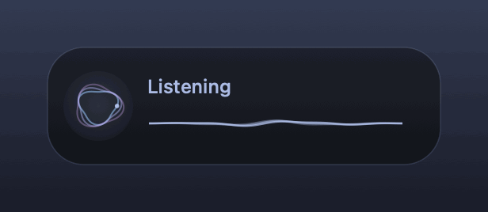
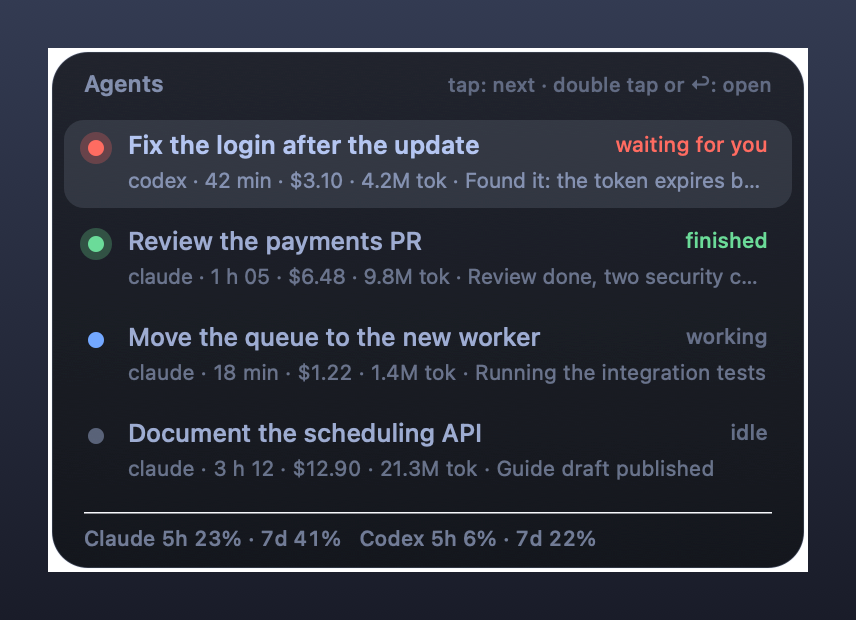

<p align="center">
  
</p>

<h1 align="center">Agent Belt</h1>

<p align="center">
  A utility belt for people who work with coding agents 🦇<br>
  A 6-key macropad with a knob becomes voice dictation, agent switching, attention lights and shortcuts for Claude Code and Codex, on macOS; agent sessions on macOS, Linux and Windows, with a tray app on Windows and key binds, menu and dictation on Hyprland.
</p>

<p align="center">
  <a href="https://github.com/feliperun/agent-belt/actions/workflows/ci.yml"></a>
  <a href="https://github.com/feliperun/agent-belt/releases/latest"></a>
</p>

<p align="center">
  
</p>

## What's on the belt

| Gadget | What it does |
|---|---|
| 🎙️ **Dictation** | Hold a key and speak: the words appear as you say them, and on release the text lands at the cursor. |
| 🔀 **Agent switching** | One key jumps to the next agent, first to the one waiting for your decision or the one that just finished. |
| 📋 **Agent menu** | Every agent with its state, recap, time, cost and tokens, plus Claude and Codex plan quotas. |
| 🦇 **New agent by voice** | *"Create an agent on Windows with Codex in coreum to look into the login"*: the session opens ready, on any machine of your tailnet. |
| 🚨 **Signal** | Keys turn red when an agent waits for you and green when one finishes; away from the Mac, a WhatsApp message arrives. |
| 🎛️ **Knob** | Turn to scroll; press to bring every agent back to the bottom of its output. |
| ⌨️ **No keypad** | Mac keyboard shortcuts and a menu bar menu do everything the macropad does. |

## The keys

```
┌──────┬──────┬──────┐   ╭────╮
│  0   │  1   │  2   │   │knob│  turn: scroll · press: agents back to the bottom
│ Esc  │ menu │Delete│   ╰────╯
├──────┼──────┼──────┤
│  3   │  4   │  5   │
│ talk │agent │ new  │
└──────┴──────┴──────┘
```

- **3, hold:** dictation (with the agent menu open, the words go to the new-agent panel).
- **4:** next agent, those waiting for you first.
- **1:** agent menu. A tap moves, a double tap opens.
- **5, hold:** a new agent by voice (below); a tap is Return, or creates the agent while its
  panel is open.
- **0, 2:** Esc and Delete, repeating while held.
- **fn+F5 on the Mac keyboard:** push-to-talk too. A tap starts and the next tap stops;
  holding records until release. Plain F5, the microphone key, stays with macOS Dictation,
  which never lets it go; turn on "Use F1, F2, etc. keys as standard function keys" to swap
  them. Soft sounds mark the start and end of a recording.

## Install

Needs macOS 14+, the Xcode Command Line Tools, `zig` (`brew install zig`) and a
[Deepgram](https://deepgram.com) API key.

```sh
export DEEPGRAM_API_KEY=...
curl -fsSL https://raw.githubusercontent.com/feliperun/agent-belt/main/scripts/update.sh | bash
```

That downloads the latest release and runs its `./install.sh`; from a clone, run
`./install.sh`. The installer:

- builds `~/Applications/Agent Belt.app` and signs it with your Apple Development
  certificate when there is one, so privacy grants survive updates;
- stores the Deepgram key in the Keychain;
- registers the `com.frb.agentbelt` LaunchAgent, which starts at login and restarts if it dies;
- installs the `agb` CLI.

The first time, allow **Agent Belt** in
[Input Monitoring](x-apple.systempreferences:com.apple.preference.security?Privacy_ListenEvent) and
[Accessibility](x-apple.systempreferences:com.apple.preference.security?Privacy_Accessibility);
[Microphone](x-apple.systempreferences:com.apple.preference.security?Privacy_Microphone) is asked on the first
dictation. The daemon opens whichever list is still missing, and `agb permissions` opens all
three. `agb status` confirms everything is in place.

### Windows

`agb` runs on Windows as a CLI (sessions, above) and a tray daemon, `agent-belt.exe`.
From a Mac with this checkout, `agb deploy <machine>` builds and copies both; then, on
the Windows machine (or over ssh), with `DEEPGRAM_API_KEY` set:

```powershell
agb install      # Deepgram key into Credential Manager, start at login, start now
agb uninstall    # remove the login item
```

| Shortcut | Action |
|---|---|
| hold `Ctrl+Alt+D` | dictation, with the same overlay as on the Mac; the text is typed where the cursor is |
| `Ctrl+Alt+Space` | the agent menu |
| `Ctrl+Alt+↑` | `agb sessions` in a terminal window |

The tray icon's menu lists the agent sessions of every machine (click one to attach in
a terminal), **New agent…** (type the request; agent, machine, repo and the highlighted intent are detected as you type), the log
(`%LOCALAPPDATA%\agent-belt\agent-belt.log`) and quit. The macropad and its lights are
macOS-only for now.

### Linux desktop (Hyprland, Omarchy)

On a Wayland desktop `agb` has no daemon: compositor key binds run it. `agb deploy`
installs it; then, with `DEEPGRAM_API_KEY` set, `agb install` saves the key
(`~/.config/agent-belt/deepgram.key`, mode 600) and, on Hyprland, adds
`~/.config/hypr/agent-belt.conf` to `hyprland.conf`:

| Shortcut | Action |
|---|---|
| hold `Ctrl+Alt+D` | dictation: `pw-record` while held, the words streaming from Deepgram into the Mac's overlay (drawn by Quickshell; notifications without it), typed with `wtype` on release |
| hold `Shift+F9` | a new agent by voice: the create-agent panel (Quickshell), with the words streaming in, the agent, machine and repo understood, the session's name and summary; release to review, hold again to add, type to fix, click a field to correct it, Return creates, Esc cancels |
| `Ctrl+Alt+Space` | `agb menu`: the sessions of every machine and **New agent…** (the panel) in walker (or fuzzel, wofi, rofi) |
| `Ctrl+Alt+↑` | `agb sessions` in a terminal |

`agb waybar` feeds a Waybar custom module (`agb install` prints the snippet): 🦇 and the
number of sessions, the list in the tooltip. `agb ptt toggle` suits desktops without
key-release binds. `agb uninstall` removes the binds.

On Omarchy (Hyprland configured in Lua, Quickshell bar and menu) `agb install` writes
`~/.config/hypr/agent-belt.lua` and requires it from `hyprland.lua`, adds a 🦇 command
module to the bar in `~/.config/omarchy/shell.json`, and `agb menu` opens Omarchy's own
menu. To dictate with another key, point a bind at `agb ptt start` / `agb ptt stop`
(with `{ release = true }`).

## Agents

<p align="center">
  
</p>

Agent Belt sees the agents running in Orca terminals and in `agb` tmux sessions, whether the
tmux client is inside Orca or another terminal. For each one it shows:

- **State:** 🔴 waiting for your decision (an approval prompt on screen), 🟢 finished and not
  seen yet, 🔵 working, ⚪ idle.
- **Title and recap:** the title Claude Code gives the session, and its summary or last request.
- **Time, cost and tokens:** summed from the transcripts, subagents included, at list prices.
- **Quotas:** the 5-hour and weekly windows of Claude and Codex.

Details and sources for each number are in [docs/agent-stats.md](docs/agent-stats.md).

The switch key and the menu take you to the chosen agent: they switch the Orca tab, restore a
minimized window and bring the app forward.

### Sessions on any machine

`agb` also creates and manages the sessions themselves: a git worktree, a tmux session and an
agent inside, on any machine of your tailnet. Closing the terminal kills nothing; attaching
again resumes.

```sh
agb new --task login --repo coreum --host felipe-windows --agent codex --prompt "look into the login"
agb new create an agent here with claude in agent-belt to review the README   # plain words
agb sessions            # interactive picker across all machines
agb ls                  # the same list, as text
agb attach <session> [machine]
agb hosts · agb doctor · agb deploy --all
agb send <session> "…" · agb peek <session> · agb stop <session>   # orchestration
```

All of it, including the `--detach` mode for scripts and other agents, is in
[docs/sessions.md](docs/sessions.md).

### New agent by voice

Hold key 5 and say it: *"codex on windows in coreum to look into the login error"*. A panel,
the dictation overlay's sibling, opens at the center of the screen with the words streaming in
as you speak and what they mean: **agent**, **machine**, **repo** and the **intent** the agent
will get as its first prompt. Release to review. Hold again to add or correct, type to fix a
word, or click a field to pick another option; tap 5 (or press Return) to create the agent,
Esc to cancel. A new Orca terminal runs `agb new` on the chosen machine.

- Exact names are matched directly; misheard ones ("codecs", "linux dois", "core um") are
  decided by [Jev](https://docs.typesafe.ai), with its key in the Keychain (service
  `agent-belt`, account `jev`) or `TYPESAFE_API_KEY`. The repo settles the machine when only
  one machine has it.
- With a single machine, the machine is always this one.
- The agent gets only the work, in your own words: a small model with no reasoning removes
  the spoken routing ("crie um agente com claude no repositório xyz que revise o login"
  sends "Revise o login.") and fixes transcription errors, adding nothing; it also names
  the session and writes the one-line summary shown in the panel. DeepSeek Flash over HTTP
  answers in about a second, with `DEEPSEEK_API_KEY` from the environment or your login
  shell (the daemon reads it once at start). Without it, Codex (`gpt-6-luna`), then Claude
  Sonnet with its own system prompt and tools replaced, both at low effort; without any,
  the words after the routing clause.
- A machine said by name wins; a repo it lacks is left for you to pick. Unnamed, the repo
  decides the machine ("no mac debian" is on the Linux box that has it).
- No repo is fine: research ("pesquise alternativas ao tmux") runs in `~/agents/<task>`,
  and the repo field offers **none (research)** to choose it.
- Repos come from an index per machine, refreshed in the background (`agb _repos-cache`).
  Each machine lists what is under the paths in `~/.config/agent-belt/repo-roots` (one per
  line), or `~/dev/micromed`, `~/dev/frb` and `~/dev` without it.

Without the keypad, **New agent…** in the menu bar menu opens the same panel to type into,
and `agb panel [words]` opens it from a terminal.

### History

Every recording is kept for 60 days, the audio and its transcript, from dictation and from
the new-agent panel: long requests are never lost. `agb history [days] [--json]` lists them;
the files are in `~/Library/Application Support/agent-belt/history` (Linux:
`~/.local/share/agent-belt/history`, Windows: `%LOCALAPPDATA%\agent-belt\history`). They are
written in the background, after the text is typed.

## Lights

| State | Keys |
|---|---|
| recording | solid white |
| transcribing | solid cyan |
| an agent waits for you | **red** |
| an agent finished | **green** |
| nothing pending | dark, with a white wave on every press |

The LED protocol was reverse-engineered from the vendor's configurator; it is in
[docs/led-protocol.md](docs/led-protocol.md). `agb led <color> <mode>` sets them by hand.

## Without the keypad

| Shortcut | Action |
|---|---|
| `⌃⌥Space` | agent menu; repeat to move, `↩` opens, `Esc` closes, `↑` `↓` move |
| `⌃⌥↑` | next agent |
| `⌃⌥↓` | agents back to the bottom |
| fn+F5 | push-to-talk |

In the menu bar, the belt's buckle light shows the state: orange recording, cyan
transcribing, red an agent waits for you, green one finished. A click opens a menu with the
agents (click one to open it), **New agent…**, the quotas, updates, permissions and the log.
If an agent has been waiting for you for 3 minutes while the Mac sits idle, a WhatsApp alert
goes out through `ford-send`.

## Configuration

Configuration lives in code: defaults are in [`src/config.zig`](src/config.zig), and
`./install.sh` regenerates `~/.config/agent-belt/config.json` from them (`--keep-config`
keeps the file). It can also change on the fly:

```sh
agb bind 0 key escape            # keys: escape, delete, return, tab, shift+tab, cmd+k, a-z, 0-9…
agb bind 3 ptt                   # push-to-talk
agb bind 4 agents                # next agent (agents desktop adds Codex/Claude Desktop windows)
agb bind 1 menu                  # agent menu
agb bind 2 command 'open -a Calculator'
agb bind 5 text 'Hello!'
```

Other settings: `"knob": "scroll"` or `"system"` (volume), `"knob_scroll_lines": 3` (negative
inverts), `"led": true`, `"f5_push_to_talk": true` and `"sounds": true`.

## CLI

```
agb status                        daemon, permissions, device, key, log
agb agents list|next|bottom       agents with state and stats · next · back to the bottom
agb new <words> | --task …        create an agent session (plain words or flags)
agb sessions|ls|attach|hosts      agent sessions across machines
agb send|peek|stop                drive a session's agent (scripts, orchestrators)
agb doctor|adopt|deploy|tm        session engine housekeeping
agb led <color 0-7> <mode 0-5>    lights by hand
agb permissions                   open the macOS privacy lists
agb version · agb update [tag]    version · update now
agb preview                       show the dictation animation without a microphone (macOS, Windows, Linux)
agb panel [words] | --close       the create-agent panel
agb history [days] [--json]       recordings and transcripts of the last 60 days
```

## Updates

Every 6 hours Agent Belt checks the GitHub releases. A newer one shows a notification with
its notes and an **Update** button, and the menus offer it too; `agb update` does it right
away. Updating builds the release from source and signs it locally, so privacy grants keep
working.

Versions come from [release-please](https://github.com/googleapis/release-please): every
`feat:`/`fix:` commit joins a release PR, and merging it publishes the tag, the
[CHANGELOG](CHANGELOG.md) and a zipped app.

## How it works

- **Input:** a rootless HID monitor reads the macropad (VID `0x514c`, PID `0x8850`); a
  CGEvent tap swallows the letters it would type, the knob's volume keys and the global
  shortcuts.
- **Dictation:** mono 16 kHz PCM streamed to Deepgram's live API (`nova-3`) while the key is
  held, the transcript growing in the overlay; on release only the last words are awaited
  (~350 ms), and the text is typed as Unicode key events once the overlay is gone. Without a
  stream (no network), the recording is sent whole on release.
- **Agents:** Orca's `terminal list`, tmux clients (matched to Orca through
  `ORCA_TERMINAL_HANDLE`), the titles agents write to the terminal and the transcripts in
  `~/.claude`.
- **Sessions:** the session engine in `src/sessions/` (Zig), the same `agb` binary on macOS,
  Linux and Windows; see [docs/sessions.md](docs/sessions.md).
- **Lights:** vendor HID reports on the `0xFF00` interface.

Architecture, vocabulary and decisions: [docs/ARCHITECTURE.md](docs/ARCHITECTURE.md),
[docs/ABSTRACTIONS.md](docs/ABSTRACTIONS.md), [docs/adr/](docs/adr/README.md). Contributors
and agents start at [AGENTS.md](AGENTS.md).

## Development

```sh
zig build -Doptimize=ReleaseSafe && zig build test
sentrux check . && sentrux gate .                  # structural gate
AGENT_BELT_DEBUG_INPUT=1 zig-out/bin/agb daemon    # every key, knob and tap event
tools/make-icon.sh        # regenerate the icon
tools/render-overlay.sh   # regenerate assets/overlay.gif
tools/render-menu.sh      # regenerate assets/menu.png
```

The log is `~/Library/Logs/agent-belt.log`. To uninstall: `./install.sh --uninstall`.

---

<sub>The name is a nod to the utility belt 🦇. This project is not affiliated with DC or
Warner Bros.</sub>
